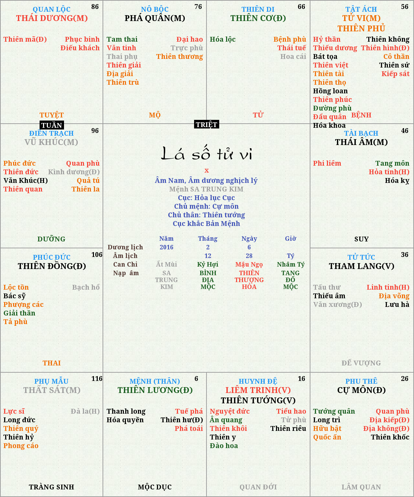

Mã nguồn mở chương trình an sao lasotuvi
===========================================
lasotuvi là mã nguồn mở chương trình an sao lá số tử vi sử  dụng ngôn ngữ lập trình python.

Cách sử dụng:

```
python manager.py runserver
```

mở trang web: 

```
http://127.0.0.1:8000
```

Chương trình yêu cầu bạn phải cài đặt Django để hoạt động. Nếu bạn chưa cài đặt, hãy sử dụng command sau đây:

```
pip install Django
```

Ví dụ:



